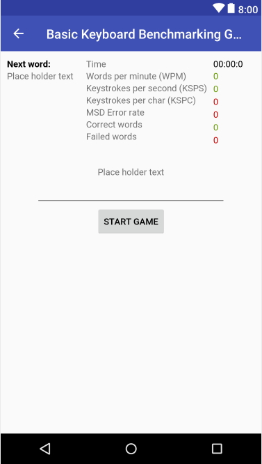
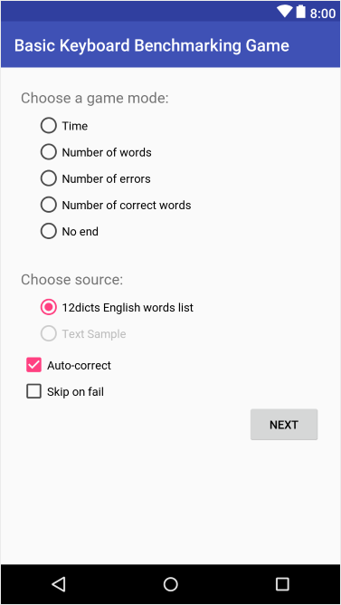

# Basic Keyboard Benchmarking Game

__Basic Keyboard Benchmarking Game__ is a simple typing bencharmk game application for android that can be used to measure the keyboard's or the user's performance when typing.

## Game Modes
* Limited Time
* Number of words
* Number of errors
* Number of correct words
* No end

## Word sources
* 12 dicts English words list - one word + preview next word
* Lengthy Text Sample __(not yet implemented)__

## Other options
* Auto-correct on/off
* Skip on fail (if the user fails the word, it just skips to the next word, the user cannot try again the same word)

## Benchmark metrics
* Chars
* Correct chars
* Correct words
* Errors
* Chars per second
* Words per second
* Total Words
* Time
* Number of times backspace keys was entered
* Keystrokes per Char (KSPC)
* Minimum String Distance Error Rate (MSD) __(not yet implemented)__

## Sources

* _Soukoreff, R. W., & MacKenzie, I. S. (2003). 140422_CHI ’03_Metrics for text entry research- an evaluation of MSD and KSPC, and a new unified error metric. Proceedings of the Conference on Human Factors in Computing Systems - CHI ’03. https://doi.org/10.1145/642611.642632_

